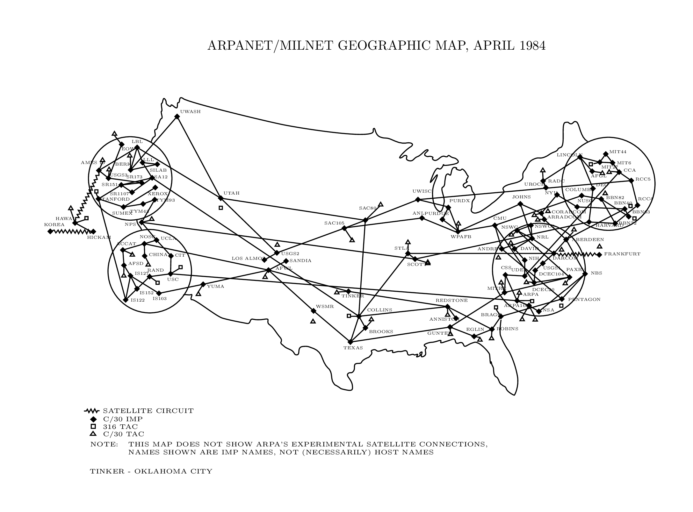
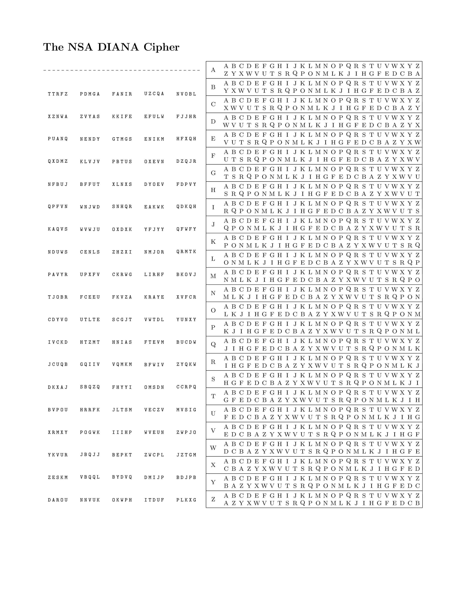
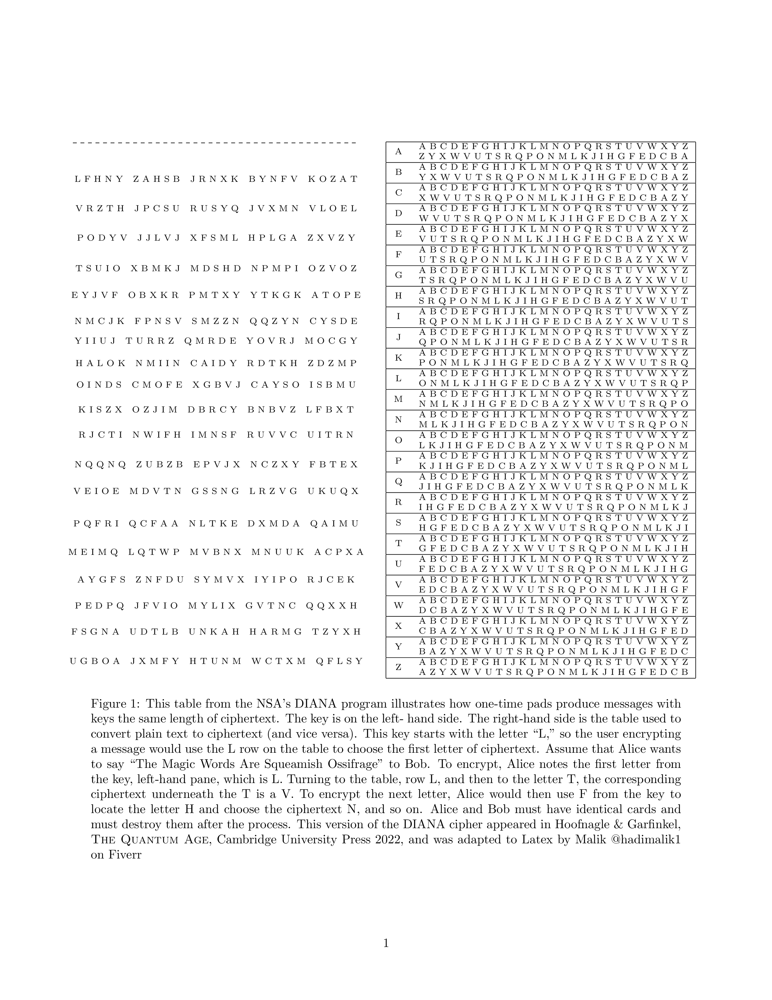
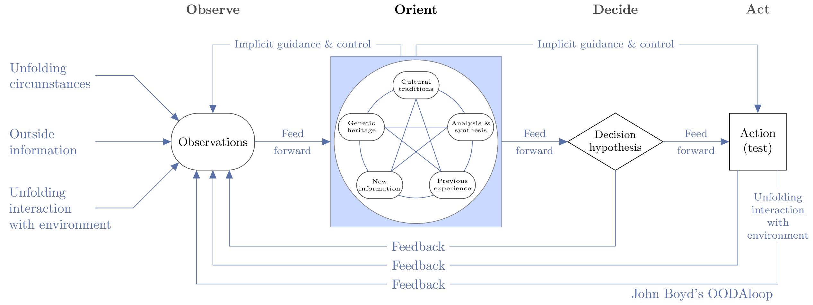
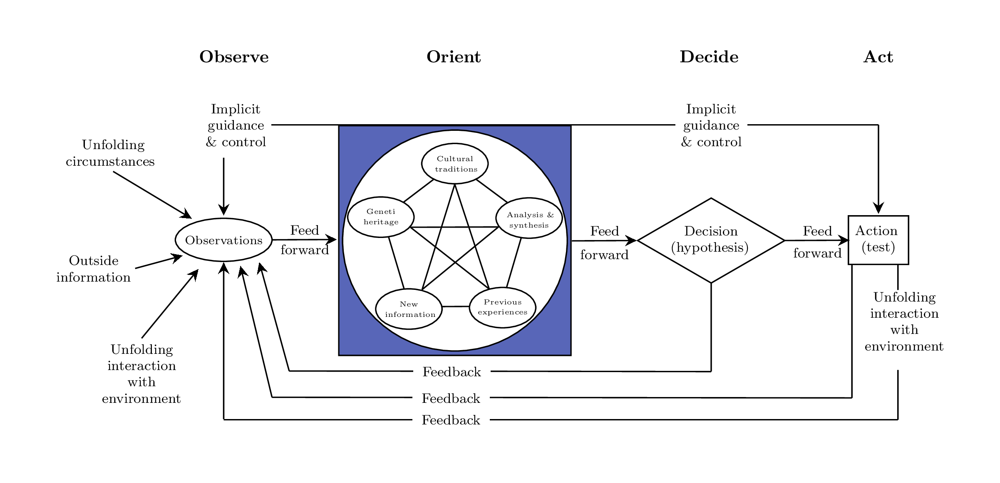
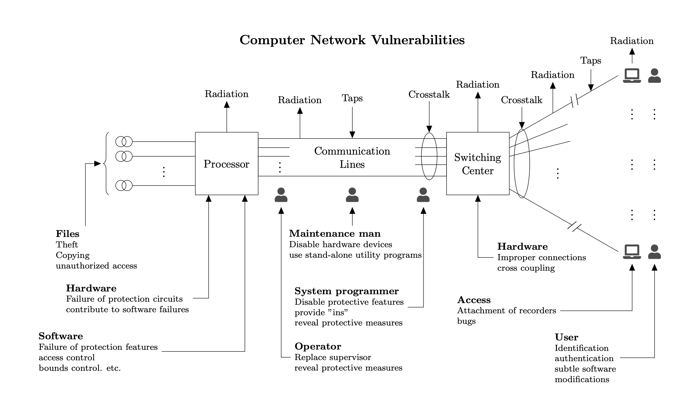
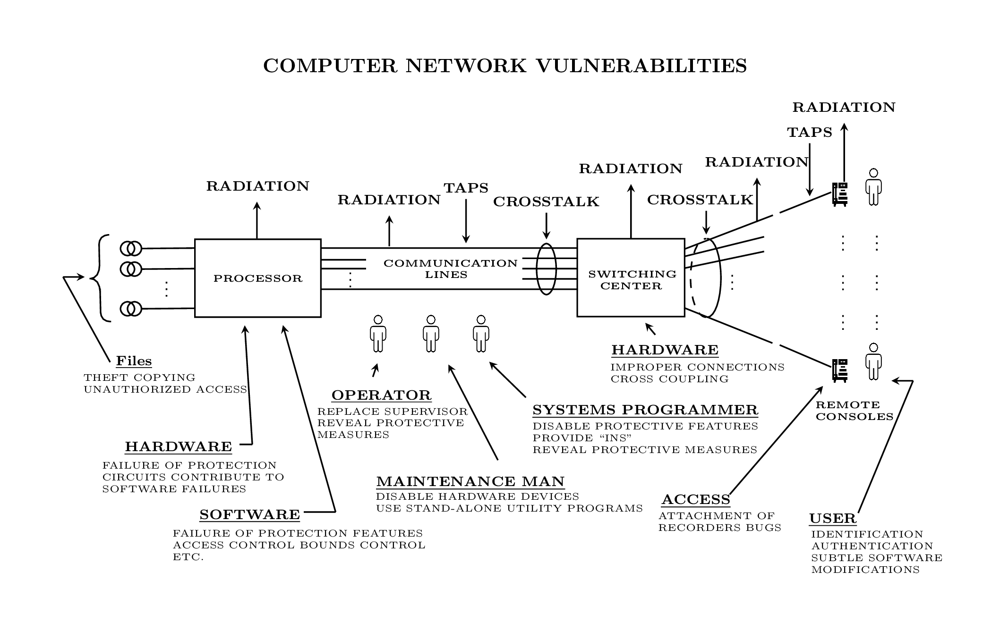
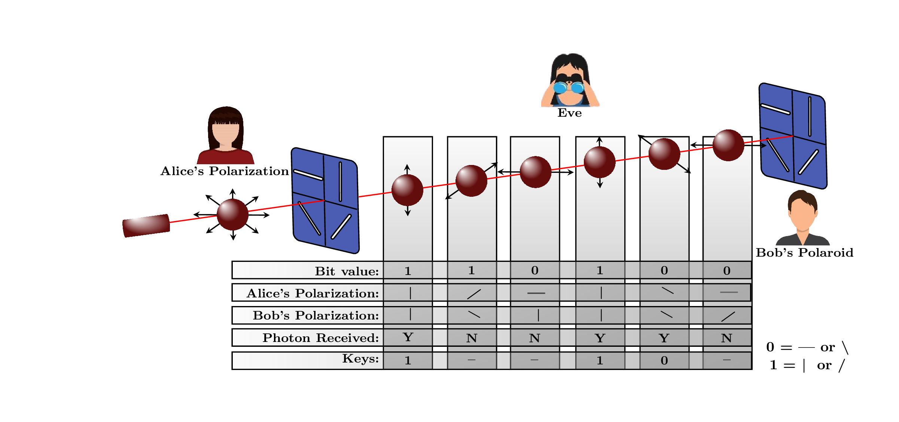
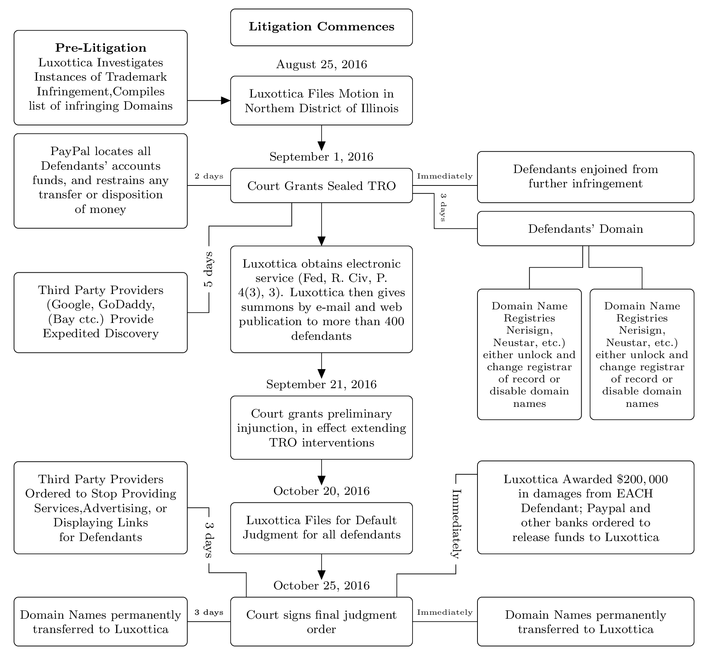
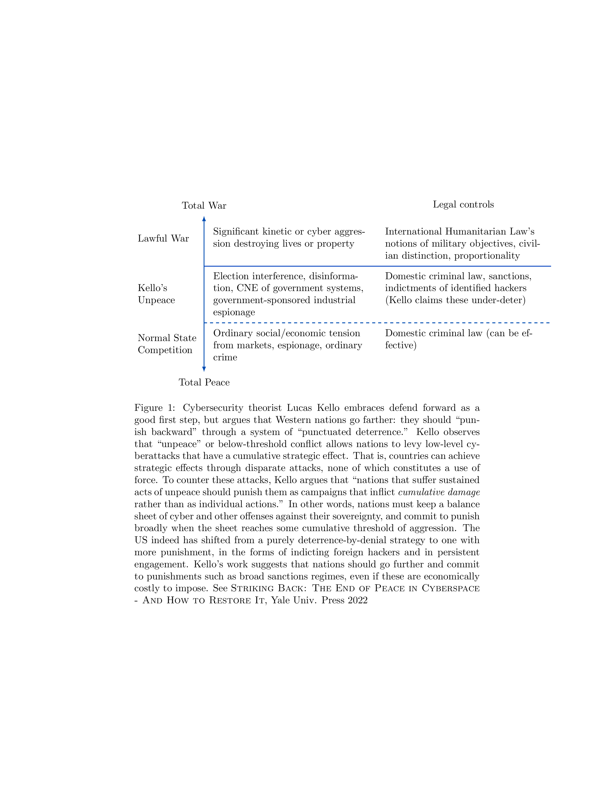

# latex-social-science-diagrams
Are you a social scientist who wants to write in LaTeX? This repository has figures from my papers that have been converted into LaTex with Tikz. It's possible to leave Word behind and have much prettier documents with figures that have infinite resolution.

## ARPANET 1984 (by Malik)

 

## The NSA DIANA Cipher v1 (by Khalil)

V1's code generates both the key and the table programatically. The key changes each time the file is compiled.

## The NSA DIANA Cipher v2 (by Malik)

 

V2 uses the key originally published by the government.

## John Boyd's OODA Loop (by Khalil)

 

## John Boyd's OODA Loop (by Malik)

 

## Computer Network Vulnerabilities (by Khalil)

In 1970, in a now declassified document, Willis Ware and colleagues reported to the Department of Defense about the multifarious challenges to computer security. Fifty years later, the “threat points” identified by Ware continue to exist in modern computer systems. Adapted from Ware W. Security Controls for Computer Systems. Rand Corporation for the Office of the Director of Defense Research and Engineering, 1970

## Computer Network Vulnerabilities (by Malik)

## BB84 Illustrated (by Malik)

We reproduced this figure from Aliberti and Bruen (2006), “Quantum Computation and Communication” Army Logistician 38.5, pp. 42–48, as it was the best illustration we could find of BB84 quantum key distribution.

 

## TRO Process in Luxottica (by Khalil)

This is a figure from Aniket Kesari, Chris Hoofnagle and Damon McCoy, Deterring Cybercrime in Berkeley Technology Law Journal Vol. 32, No. 3 (2017), pp. 1093-1134. 

Luxottica, a company that owns many sought–after brands of eyewear, provides a paradigmatic example of employing Rule 65 in the IP enforcement context, one that is troubling in scale and presages a kind of automation of litigation. As outlined in this figure, in a single 2016 case, Luxottica sued 478 defendants that were allegedly infringing marks in operating 1,024 domains and 52 marketplaces (most of which were “stores” on eBay). The case caption is so long that it occupies five pages in print, and in the electronic filing system, the defendants are listed as “The Partnerships and Unincorporated Associations Identified on Schedule A.” Luxottica filed the case on August 24, 2016, and received a TRO nine days later against all the defendants. Luxottica argued that relief without notice was necessary because the targeted domain owners would likely move their operations if told that an enforcement action was afoot. The lack of notice gave Luxottica another advantage—Rule 65 requires that TROs lacking notice receive a hearing as soon as possible, and so Luxottica received a preliminary injunction less than a month from the date the complaint was filed. This figure outlines the basic steps taken by Luxottica to obtain the TRO and the many varied entities bound by it. 

 

## Kello's Unpeace and Punctuated Deterrence

This is a figure from Cybersecurity in Context (2024).

